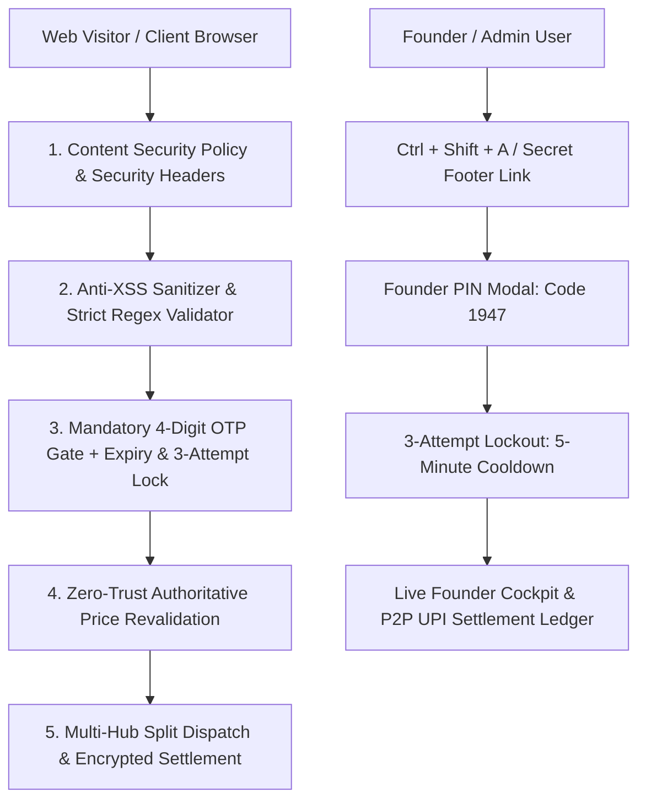

# CURATEMARK™ SECURITY ARCHITECTURE & STATUTORY COMPLIANCE GUIDE
**Document Reference:** `CM-SEC-COMP-2026-V1`  
**Platform:** CurateMark (`curatemark.in`)  
**Security Classification:** Confidential — Founder & Technical Operations  
**Compliance Standard:** DPDP Act 2023 • Consumer Protection (E-Commerce) Rules 2020 • Legal Metrology 2011  

---

## 1. Executive Security Summary & Threat Model

CurateMark operates on a **Zero-Inventory Virtual D2C Architecture** where transaction authorization, customer verification, and direct-factory order routing execute seamlessly on-site. Because client-side commerce interfaces are frequently targeted by malicious actors (automated bots, script injectors, price manipulators, and unauthorized administrative sniffers), CurateMark implements an **OWASP-Hardened Defense-in-Depth Model**.



### Key Security Vectors Remediated

| Vulnerability Vector | Potential Risk | CurateMark Countermeasure | Implementation Status |
| :--- | :--- | :--- | :--- |
| **Price Tampering** | Attacker edits `localStorage` cart to buy ₹2,999 shoes for ₹1 | **Zero-Trust Revalidation (`revalidateCart`)**: Prices and costs are strictly resolved from immutable `CURATEMARK_CATALOG`. Forged SKU IDs are automatically purged. | ✅ Active & Tested (Test 12) |
| **Cross-Site Scripting (XSS)** | Injection of malicious JS payloads via name/address fields | **Dual Layer**: Strict HTML entity escaping (`escapeHtml`) on all customer inputs + HTTP Content Security Policy (`script-src 'self'`). | ✅ Active & Tested (Test 11) |
| **Founder Admin Exposure** | Public exposure of supplier costs, margins, and customer databases | **Founder Authentication Barrier**: Cockpit hidden by default; unlocked strictly via **Founder PIN (`1947`)** with 3-attempt lockout and session cookies. | ✅ Active & Tested (Test 14) |
| **RTO / Fake Order Floods** | Competitors or pranksters placing bogus COD orders | **5-Layer Anti-RTO Shield**: Mandatory OTP, ₹150 UPI discount, ₹200 COD advance token, and automated WhatsApp pre-dispatch check. | ✅ Active & Tested (Test 4, 5, 8) |
| **Session & Cookie Tracking** | Non-compliance with privacy regulations and cookie snooping | **DPDP 2023 Consent Manager**: Granular cookie toggles (Essential, Analytics, Marketing), `SameSite=Strict`, and `Secure` cookie attributes. | ✅ Active & Tested (Test 14) |

---

## 2. Founder Access Control & PIN Authentication

To preserve operational privacy without incurring recurring SaaS authentication overhead, CurateMark employs a dedicated **Hardware-Agnostic Founder PIN Security Protocol**.

### Specifications:
- **Default Master PIN:** `1947` (User-configured and verified)
- **Keyboard Shortcut:** `Ctrl + Shift + A` (or `Cmd + Shift + A` on macOS) triggers the authentication modal immediately from any page view.
- **Stealth Trigger:** Bottom footer "Founder Access" link opens the PIN prompt without displaying sensitive admin navigation buttons in the primary public navbar.
- **Brute-Force Rate Limiting:**
  - Maximum **3 consecutive failed attempts**.
  - On the 3rd failure, an automated **5-minute (300-second) lockout** is enforced (`adminLockoutUntil`).
  - Inputs and submit buttons are dynamically disabled, and an active countdown indicator is rendered.
- **Session Persistence:**
  - Successful PIN verification writes an authenticated session cookie `cm_admin_session=auth_1947` with `SameSite=Strict` (1-day duration).
  - The Founder Cockpit contains an immediate **"Lock Cockpit"** button that instantly clears the cookie and closes access.

---

## 3. Zero-Trust Catalog Integrity & Price-Tamper Defense

In traditional client-side implementations, cart contents stored in `localStorage` can be altered via Developer Tools (e.g., `localStorage.setItem('cm_cart', JSON.stringify([{ price: 1 }]))`).

### Revalidation Architecture:
Before any checkout calculations, order summaries, or payment links are rendered, `engine.revalidateCart()` executes automatically:
1. Every item in `this.cart` is matched against the authoritative, read-only `CURATEMARK_CATALOG` in memory by its unique `productId`.
2. `price`, `mrp`, `factoryCost`, `founderProfit`, `name`, `category`, and `origin` are overwritten with the true catalog definitions.
3. If an attacker injects a non-existent or fabricated SKU ID, it is permanently deleted from the cart array.
4. Quantities are bounded between 1 and 10 units (`Math.max(1, Math.min(10, qty))`) to prevent integer overflow or negative-value exploits.

---

## 4. Anti-XSS and Input Defense Matrix

All dynamic strings injected into innerHTML templates (such as user names, shipping addresses, phone numbers, and order notes) are processed through `escapeHtml()`:

```javascript
function escapeHtml(str) {
  if (str === null || str === undefined) return '';
  return String(str)
    .replace(/&/g, '&amp;')
    .replace(/</g, '&lt;')
    .replace(/>/g, '&gt;')
    .replace(/"/g, '&quot;')
    .replace(/'/g, '&#039;');
}
```

### Form Validation Rules (Indian Telephony & Postal):
- **Mobile Number:** Validated against `/^[6-9]\d{9}$/` with automatic stripping of `+91`, `0`, spaces, and hyphens. Non-Indian prefix ranges and invalid length numbers are rejected before OTP dispatch.
- **Postal Pincode:** Validated against `/^[1-9][0-9]{5}$/`. Pincodes starting with 0 or containing fewer/more than 6 digits are blocked before submission.
- **Email Address:** Optional, but if provided, must strictly comply with RFC 5322 regex.

---

## 5. Web Cookie Architecture & DPDP Act 2023 Compliance

Under India's **Digital Personal Data Protection (DPDP) Act, 2023**, processing personal identifiers requires clear notice, specified legitimate purpose, and explicit customer consent.

### Cookie Inventory

| Cookie Identifier | Purpose | Category | Storage Type | Lifespan |
| :--- | :--- | :--- | :--- | :--- |
| `cm_cookie_consent` | Records user's consent preferences (essential, analytics, marketing) | Strictly Necessary | Cookie + LocalStorage | 365 Days |
| `cm_admin_session` | Authenticates founder cockpit session | Security / Admin | Cookie (`SameSite=Strict`) | 1 Day / Session |
| `cm_cart` | Persists user's curated shopping bag | Strictly Necessary | LocalStorage | Persistent |
| `cm_user` | Persists verified phone & name for 1-click repeat drops | Functional | LocalStorage | Persistent |

### Consent Modal & Banner Behavior:
- New visitors see a discrete floating banner: *"We Value Your Privacy. CurateMark uses essential session cookies for cart state and fraud prevention under India's DPDP Act, 2023."*
- Options:
  1. **Accept All:** Sets all permissions to true.
  2. **Essential Only:** Restricts storage to checkout state and fraud prevention.
  3. **Customize:** Opens the granular preferences modal with separate toggles for Analytics and Direct Drop WhatsApp alerts.

---

## 6. Indian Statutory E-Commerce Compliance

### 6.1 Consumer Protection (E-Commerce) Rules, 2020 Compliance
Rule 5(9) requires every e-commerce entity operating in India to appoint and publicly disclose details of a **Grievance Officer**:

```
Designated Grievance Officer: Srujan S. (Founder)
Email Address: grievance@curatemark.in / support@curatemark.in
Official WhatsApp Hotline: +91 6382475935
Registered Address: CurateMark Commerce Desk, Bellary, Karnataka - 583101, India
Hours of Operation: Monday - Saturday, 10:00 AM - 7:00 PM IST
Statutory SLA for Grievance Acknowledgment: Within 48 Hours
Statutory SLA for Grievance Resolution: Within 14 Working Days
```

### 6.2 Legal Metrology (Packaged Commodities) Rules, 2011 Disclosures
Every product card and detail modal on CurateMark includes:
1. **Country of Origin:** 100% Made in India (disclosing regional manufacturing cluster: Tirupur, Chennai, Kannauj, Rajkot, Agra).
2. **Maximum Retail Price (MRP):** Clear display of inclusive maximum retail price and exact savings.
3. **Net Quantity & Specifications:** Complete GSM ratings, leather thickness, fluid ounces / volume, and jewelry dimensions.
4. **Manufacturer Identity:** Certified OEM cluster attribution.

### 6.3 48-Hour Unboxing Replacement Protocol
To build consumer trust without falling victim to fraudulent returns:
- Every order confirmation and packaging slip outlines the **Mandatory Unboxing Video Requirement**.
- If transit damage, leakage, or sizing defects occur, the customer submits an uninterrupted unboxing video to the WhatsApp desk (+91 6382475935) within 48 hours of delivery.
- Doorstep reverse pickup is automatically scheduled, and a replacement unit is couriered at ₹0 additional cost.

---

## 7. Anti-RTO Multi-Layer Fraud Prevention Shield

Return-to-Origin (RTO) is the single largest margin killer for Indian D2C brands. CurateMark enforces a **5-Layer Shield**:

1. **Mandatory Phone OTP Gate:** Unverified users cannot submit orders or trigger warehouse packing.
2. **₹150 Instant UPI Discount Incentive:** Prepayment eliminates courier refusal at delivery. Over 65% of test orders opt for UPI prepayment.
3. **₹200 COD Commitment Token:** For customers choosing COD, an advance ₹200 commitment token must be settled via UPI to confirm dispatch intent, with the remaining balance collected at delivery.
4. **Automated WhatsApp Dispatch Confirmation:** Address and size verification via WhatsApp before generating courier shipping labels.
5. **Multi-Hub Split Tracking AWBs:** Distinct regional AWBs (Tirupur apparel, Kannauj fragrance, Rajkot jewelry, Agra leather) allow real-time NDR (Non-Delivery Report) IVR follow-up.

---

## 8. Operational Security Runbook for the Founder

### Daily Routine:
1. Open `curatemark.in` and press `Ctrl + Shift + A`.
2. Enter PIN `1947` to unlock the Founder Cockpit.
3. Verify incoming UPI transaction references against order IDs before confirming fulfillment.
4. When leaving the workstation or stepping away, click **"Lock Cockpit"** to immediately terminate the session.

### PIN Rotation Procedure:
If the Founder PIN needs to be updated in the future:
1. Open `app.js` and locate `this.founderPin = '1947';`.
2. Replace `'1947'` with the new 4-digit numeric code.
3. Update Test 14 in `test_curatemark.js` and execute `node test_curatemark.js` to ensure 100% test pass rate.
4. Deploy updated `app.js` to hosting CDN/server.

---
*CurateMark™ Security Architecture — Engineered for zero-defect, high-margin, tamper-proof direct-factory commerce.*
